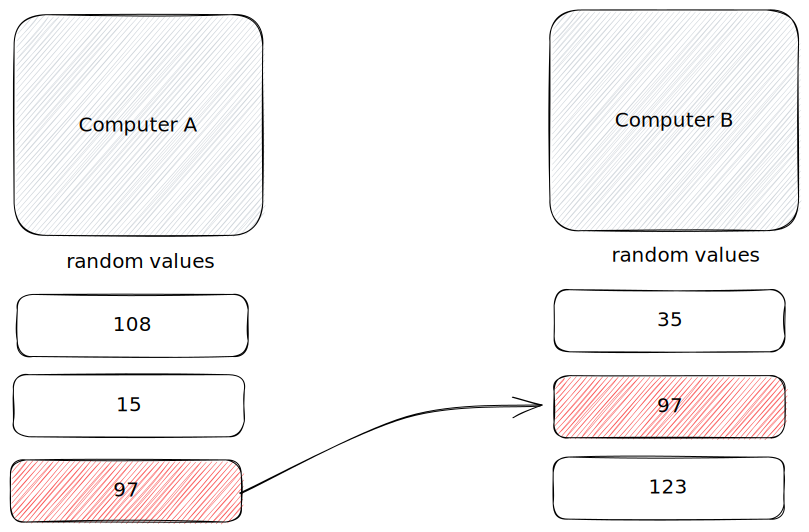

# Intro

#### When

* If the system is receiving the **same request** and needs to use **resource** for those requests that producing the **same response**, if business logic allows, it might be a good optimization to **store that response temporarily**, and return without processing anything, thus saving resources

> **Key to analyze** - same response for same request, **Priority to apply** - only if business logic allows it

> Example - from technical perspective graphical computing got really advanced nowadays, and it can really optimize resource usage based on activity of the content being rendered, for example, **when gaming** it uses all resources to maximize smoothness, and when rendering **static content** it reduces processes to save resources, so while the **same amount of requests** being received to render the image, it won't, and just return the **previous rendered image**  &#x20;

Use

* Blog Post
* Dashboard
* E-commerce
* Mobile apps

Don't use

* Real-time update apps
* Highly-transactional apps
* Security-Sensitive apps
* Dynamic or User-specific Content

***

#### What

**Caching** - technique used in computer systems to store and retrieve **frequently accessed** or computationally expensive data in a faster and more efficient manner

Caching is

* temporary storage
* data reuse mechanism
* performance optimization

Caching isn't&#x20;

* permanent data storage
* real-time update mechanism
* substitute for database or API
* security or authorization

***

#### Why

* improved system performance
* reduced resource utilization
* enhanced scalability
* lower latency
* cost efficiency

**How**

* In&#x20;

&#x20;

* In Memory Cache
* Distributed Cache
* App Level Cache

