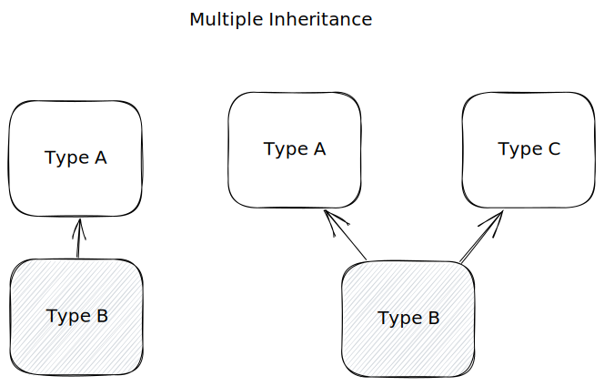

# Unique Value Types


Image a situation where thousands of objects must have unique identifier. It may be possible with random value, but when those objects are generated by 2 different machines, probability of getting unique identifier is way below


####



#### When

* primary keys in databases
* session identifiers
* identifiers for objects or entities
* cryptography operations
* file name
* transaction or message operations

***

#### Why

* extremely low probability of generating duplicate values

***

#### What

* unique values types - types that are guaranteed to be unique within the given context
* unique value types use hashing and randomness
* some implementations also use timestamp

***

#### How

Unique Value Types

* `Guid` - Global Unique Identifier

Operations

* Parse
* Create with value
* Create empty


Usage

* Creating with value

```csharp
var guid = Guid.NewGuid();
```

* Creating empty

```csharp
var guid = Guid.Empty;
```

* Converting to string

```csharp
var guidString = guid.ToString();
```

* Parsing from string

```csharp
var parsedGuid = Guid.Parse("4da8b2f0-9b30-49e2-87bf-b010b5ff16df");
```

* Equality

```csharp
var guidA = Guid.NewGuid();
var guidB = Guid.NewGuid();

if(guidA == guidB)
    Console.WriteLine("The are same!")
```

* Validating

```csharp
var guid = Guid.Empty;

if(guid == Guid.Empty)
  Console.WriteLine("Invalid Guid");  
```


Best Practices

* always use static `Guid.NewGuid` method
* use collision detection strategy
* do not use GUIDs as human-readable identifiers
* store as binary for better space and efficiency


Bad Practices

* manually generating unique values
* using sequential `Guid` ( eg. using timestamps )
* using for frequently written tables
* using `Guid` s for cryptography
* exposing `Guid` values publicly


***

History&#x20;

Version of `Guid`


